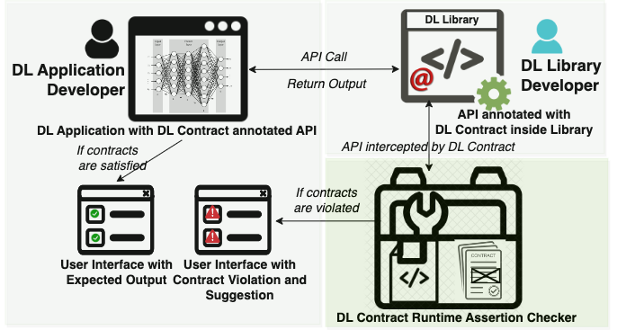

# DLContract : Design by Contract for Deep Learning APIs

This webpage contains the reproducibility package, source code, benchmark, and results for the paper - **"Design by Contract for Deep Learning APIs"**, which appeared in ESEC/FSE’2023: The 31st ACM Joint European Software Engineering Conference and Symposium on the Foundations of Software Engineering at San Francisco, California.



### Authors
* Shibbir Ahmed, Iowa State University (shibbir@iastate.edu)
* Sayem Mohammad Imtiaz, Iowa State University (sayem@iastate.edu)
* Samantha Syeda Khairunnesa, Bradley University (skhairunnesa@fsmail.bradley.edu)
* Breno Dantas Cruz, Iowa State University (bdantasc@iastate.edu)
* Hridesh Rajan, Iowa State University (hridesh@iastate.edu)

**PDF** <a href="https://dl.acm.org/doi/pdf/10.1145/3611643.3616247"> DLContract Paper at_ESEC/FSE2023 </a>

**DOI:** 
The paper is published in ACM Digital Library:
<a href="https://dl.acm.org/doi/10.1145/3611643.3616247"> [ACM DOI] </a>

The artifact is published in Zenodo:
[](https://doi.org/10.5281/zenodo.8271853)


## Installation

To run DLContract, we need to install Python 3.x, Python 3.7 is recommended. The current version has been tested on Python 3.7. It is recommended to install Python virtual environment for the tool. Furthermore, we used bash shell scripts to automate running benchmark and Python scripts. Below are step-by-step instructions to setup the environment and run the tool.

### Environment Setup

Follow these steps to create a virtual environment and clone the DLContract repository.

1. Clone this repository and move to the directory using the terminal:

```
git clone https://github.com/shibbirtanvin/DLContract
cd DLContract/ReproducibilityPackage/@Keras
```

2. Give execution permission using the following command:

```
chmod +x setup.sh
```

3. Run shell script using the following command to create a virtual environment:

```
./setup.sh
```

Please ensure all the following commands (in setup.sh) executed in MacOS (intel) or Linux terminal.
No need to add any new commands in setup.sh:

```
#!/bin/sh

PYTHON_VERSION="3.7"

python3 -m venv venv
source venv/bin/activate
pip install -r requirements.txt
deactivate
cp -f Augkeras/training.py venv/lib/python$PYTHON_VERSION/site-packages/tensorflow/python/keras/engine/
cp -f Augkeras/core.py venv/lib/python$PYTHON_VERSION/site-packages/tensorflow/python/keras/layers/
cp -f DLContract/* venv/lib/python$PYTHON_VERSION/site-packages/contracts
source venv/bin/activate
python motivExample.py
```

In the setup.sh, ```PYTHON_VERSION="3.7"``` for Python 3.7.x is by default
However, it can be changed for the other version ```PYTHON_VERSION="3.8" ``` for Python 3.8.x

If required, run the following command to update pip on Python: `python3 -m pip install --upgrade pip`. Alternatively, you can follow the [Python documentation](https://packaging.python.org/en/latest/guides/installing-using-pip-and-virtual-environments/) to install virtual environment on your machine.

By default *motivExample.py* will be executed and *data normalization contract* will be shown as contract violation error.

4. To execute the motivating example buggy and correct programs execute the following commands in the terminal:

```
source venv/bin/activate
python motivExampleBug.py
python motivExampleCorrect.py
```

To run the tool with more sample example Buggy and Correct programs with example outputs, please refer to the [installation file](https://github.com/shibbirtanvin/DLContract/blob/main/INSTALL.md) for detailed instructions. The scripts to execute all DL programs from collected benchmarks are provided here in the [scripts to execute all the codes in the collected benchmarks](https://github.com/shibbirtanvin/DLContract/tree/main/ReproducibilityPackage/scripts).

## Writing Contracts 
## Example 1:
In our technique, we annotate the library APIs with @contract and @new_contract annotations to specify preconditions and postconditions. 
Consider this simple example, we want to write a contract on the Keras training API, fit. Basically, to check whether the data has been within the required range before training. So, this is a precondition for Fit API. We use the formal parameter ‘x’ to write this contract using @new_contract annotation and defining the function data_normalization with parameter (x). Here, in the data_normalization function, library API designers compute the range of training data which is declared as ‘normalized_interval’ variable. Then, library API designers can specify an appropriate range of normalization interval, here we used >2 from prior research. If contract is violated then suggestion to fix the bug is raised as ContractException message.

```
  @new_contract
  def data_normalization(x):
      normalized_interval = np.max(x) - np.min(x)
      print(normalized_interval)
      if(normalized_interval>2.0):
          msg = "Data should be normalized before training, should not be within range " + \
                     str(np.min(x)) + " and " + str(np.max(x)) + " ; So, after loading train and test data should be divided by value " + 
                     str(np.max(x))
          raise ContractException(msg)
  @contract(x='data_normalization')
  def fit(self,
          x=None,
          y=None,
          batch_size=None,...)
```
After executing this code with our approach using DL Contract annotated Keras, we get the data normalization contract violation message and the fix suggestions for that buggy program.

```
ContractViolated: Data should be normalized before training, train and test data should be divided by value 255.0.
```

## Example 2:
Let us see another example. Here, we want to write a contract on Compile API inside Keras library. We would like to specify with an ideal last layer activation function and loss function for multi class classification problem. Here, activation function is not in the parameters list of compile API but it has been in the Dense API which might have been called in the earlier stage of ML pipeline. To write such inter-API contract, we can annotate ‘contract_checkerfunc1’ using model object type Anded with ‘contract_checkerfunc2’ using loss parameter with string type. In this case, loss is a formal parameter in compile API.
In the contract_checkerfunc1 function using @new_contract annotation, we compute the last_layer_output_class and activation_func from the model object . Then, we can check contract violation with an ideal activation function ‘softmax’ and ideal loss function in ‘contract_checkerfunc2’  for multiclass classification. 
Here, the ‘contract_checkerfunc2’ has been specified ANDed with contract_checkerfunc1, So, ‘contract_checkerfunc2’ only executed after contract_checkerfunc1. In this case, Contract violation is shown if both preconditions of appropriate activation and loss function are violated for multiclass classification.

```
  @new_contract
  def contract_checker1(model):
        last_layer_output_class = int(str((model.layers[len(model.layers) - 1]).output_shape).split(',').pop(-1).strip(')'))
        activation_func = str(model.layers[len(model.layers) - 1].__getattribute__('activation')).split()[1]
        global msg1
        msg1 =''
        if (last_layer_output_class >=3):
            if (activation_func not in 'softmax'):
                #global msg1
                msg1= 'For multiclass classification activation_func should be softmax'
                #msg = msg1
                print(msg1)
                raise ContractException(msg1)
  @new_contract
  def contract_checker2(loss):
          if (loss not in 'categorical_crossentropy'):
              msg2 = 'loss_function should be categorical crossentropy'
              raise ContractException(msg2)
  @contract(self='model, contract_checker1')
  @contract(loss='str, contract_checker2')
  def compile(self,
              optimizer='rmsprop',
              loss=None,
              metrics=None,
              loss_weights=None,
              sample_weight_mode=None,
              weighted_metrics=None,
              **kwargs):
    """Configures the model for training...
```
After executing this code with our approach using DL Contract annotated Keras, we get the incorrect activation and loss contract violation message and how to solve this for multiclass classification problem.

```
ContractViolated: For multiclass classification activation_func should be softmax, loss should be categorical crossentropy.
```

## Example 3:
Let us see another example how postcondition can be specified using our technique. 
To prevent overfitting, a contract can be added to the output of Fit API in Keras using @contract and the postcondition can be ensured using the overfitting function specified with returns. 
In this overfitting function inside the @new_contract annotation, the API designers can use the obtained history object to compute the training loss “diff_loss” and validation loss “diff_val_loss” for each corresponding epoch.
Then, we can check if the difference between the validation loss of consecutive epochs tends to increase while the difference between training loss continues to decrease. 

```
  @new_contract
  def overfitting(history):
      h=history
      last_layer_output_class = int(str((model.layers[len(model.layers) - 1]).output_shape).split(',').pop(-1).strip(')'))
      activation_func = str(model.layers[len(model.layers) - 1].__getattribute__('activation')).split()[1]
      loss_function = model.loss
      i=0
      while i <= len(h.epoch) - 2:
          epochNo = i + 2
          diff_loss = h.history['loss'][i + 1] - h.history['loss'][i]
          diff_val_loss = h.history['val_loss'][i + 1] - h.history['val_loss'][i]
          i += 1
          if(diff_val_loss>0.0):
              if(diff_loss<=0.0):
                 msg = "  After Epoch: " + str(epochNo) + ", diff_val_loss = " + str('%.4f' % diff_val_loss) + " and diff_loss = " \
                     + str('%.4f' % diff_loss) + " causes overfitting"
                 raise ContractException(msg)
  @contract(returns='overfitting')
  def fit(self,
          x=None,
          y=None,
          batch_size=None,...)
```

If the condition is not met then, a contract violation method is thrown when a buggy DL program uses this annotated Fit API.    
There could be different reasons for overfitting.  After executing a buggy code due to overfitting, our approach using DL Contract annotated Keras, we can get this kind of contract violation message for overfitting problem.

```
ContractViolated: After Epoch: 11, diff_val_loss = 0.34 and diff_loss = -0.12 causes overfitting.

```

### Cite the paper as
```
@inproceedings{ahmed23dlcontract,
  author = {Shibbir Ahmed and Sayem Mohammad Imtiaz and Samantha Syeda Khairunnesa and Breno Dantas Cruz and Hridesh Rajan},
  title = {Design by Contract for Deep Learning APIs},
  booktitle = {ESEC/FSE'2023: The 31st ACM Joint European Software Engineering Conference and Symposium on the Foundations of Software Engineering},
  location = {San Francisco, California},
  month = {December 03-December 09},
  year = {2023},
  entrysubtype = {conference},
  abstract = {
    Deep Learning (DL) techniques are increasingly being incorporated in critical software systems today. DL software is buggy too. Recent work in SE has characterized these bugs, studied fix patterns, and proposed detection and localization strategies. In this work, we introduce a preventative measure. We propose design by contract for DL libraries, DL Contract for short, to document the properties of DL libraries and provide developers with a mechanism to identify bugs during development. While DL Contract builds on the traditional design by contract techniques, we need to address unique challenges. In particular, we need to document properties of the training process that are not visible at the functional interface of the DL libraries. To solve these problems, we have introduced mechanisms that allow developers to specify properties of the model architecture, data, and training process. We have designed and implemented DL Contract for Python-based DL libraries and used it to document the properties of Keras, a well-known DL library. We evaluate DL Contract in terms of effectiveness, runtime overhead, and usability. To evaluate the utility of DL Contract, we have developed 15 sample contracts specifically for training problems and structural bugs. We have adopted four well-vetted benchmarks from prior works on DL bug detection and repair. For the effectiveness, DL Contract correctly detects 259 bugs in 272 real-world buggy programs, from well-vetted benchmarks provided in prior work on DL bug detection and repair. We found that the DL Contract overhead is fairly minimal for the used benchmarks. Lastly, to evaluate the usability, we conducted a survey of twenty participants who have used DL Contract to find and fix bugs. The results reveal that DL Contract can be very helpful to DL application developers when debugging their code.
  }
}
```
